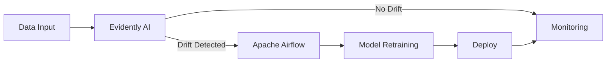
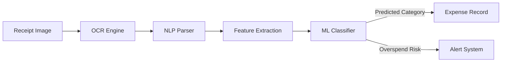

# 📸 Visual Enhancements Guide

## Current State ✅
Your portfolio structure is now professional and recruiter-ready. The next layer is **visual polish** to make it stand out even more.

---

## 1. FEATURED PROJECT SCREENSHOTS

### Where to Add
```
Project Card
├─ Badge (Live/In Dev)
├─ Title
├─ Screenshot (NEW - 400x250px, rounded corners)
├─ Problem/Solution/Result boxes
├─ Tech Stack
└─ Links
```

### Self-Healing MLOps Pipeline

**Ideal Screenshot Options:**

**Option A: Monitoring Dashboard**
- Show Evidently AI dashboard with drift metrics
- Display: Distribution shift graph, data quality score, retraining status
- Include: Timestamp, model version, next scheduled run
- Visual: Blue/gold color scheme matching your site

**Option B: Airflow DAG Visualization**
- Show Apache Airflow DAG graph
- Display: Pipeline stages (Extract → Monitor → Detect Drift → Retrain → Deploy)
- Visual: Flow diagram showing automation

**Option C: Streamlit UI**
- Show live dashboard you deployed to Hugging Face
- Display: Real metrics, charts, status indicators
- Visual: Clean, professional

**Recommendation:** Go with **Option C** (your actual deployed dashboard) - most authentic and impressive

**How to Get Screenshot:**
1. Go to: https://fortaditya-self-healing-ml-pipeline.hf.space/
2. Take clean screenshot of main dashboard area
3. Crop to 400x250px
4. Use tool like SnagIt or browser dev tools screenshot feature
5. Save as `mlops-pipeline-dashboard.png` in portfolio folder

---

### MyBudgetAI - Smart Expense Analysis

**Ideal Screenshot Options:**

**Option A: Expense List with Categories**
- Show list of expenses with auto-categorized labels
- Include: Amount, category badge (Food, Transport, etc.), date
- Colors: Green for savings, red for overspend alerts

**Option B: Receipt Upload & OCR**
- Show receipt image upload interface
- Display: Before/After OCR parsing
- Show extracted data: Amount, vendor, category

**Option C: Budget Dashboard**
- Show budget overview with charts
- Display: Spending by category (pie chart), remaining budget, trends
- Include: AI-generated recommendations

**Recommendation:** 
- If project is live: Use **Option A** (expense list view)
- If project in-progress: Create mockup of **Option C** (budget dashboard)

**How to Create/Get Screenshot:**
1. If live: Take screenshot from your deployed app
2. If mockup needed: Use Figma/Sketch to create mockup UI
3. Crop to 400x250px
4. Save as `mybudgetai-dashboard.png`

---

## 2. METRICS BADGES

### What They Do
Visual indicators of impact/achievement next to key results.

### Examples

#### Self-Healing Pipeline
```
⏱️ Days → Minutes    (Gold badge with arrow icon)
🔄 100% Automated    (Blue badge)
📊 99.7% Uptime      (Green badge)
```

HTML Template:
```html
<div class="metrics-badges">
  <div class="badge metric-time">
    <i class="fas fa-clock"></i>
    <span>Days→Mins</span>
  </div>
  <div class="badge metric-auto">
    <i class="fas fa-robot"></i>
    <span>100% Auto</span>
  </div>
  <div class="badge metric-uptime">
    <i class="fas fa-heartbeat"></i>
    <span>99.7% Uptime</span>
  </div>
</div>
```

CSS (Add to style.css):
```css
.metrics-badges {
  display: flex;
  gap: 1rem;
  margin: 1.5rem 0;
  flex-wrap: wrap;
}

.badge {
  display: flex;
  align-items: center;
  gap: 0.5rem;
  padding: 0.6rem 1rem;
  border-radius: 20px;
  font-size: 0.85rem;
  font-weight: 700;
  text-transform: uppercase;
}

.metric-time {
  background: linear-gradient(135deg, #f59e0b, #f97316);
  color: white;
}

.metric-auto {
  background: linear-gradient(135deg, #3b82f6, #0ea5e9);
  color: white;
}

.metric-uptime {
  background: linear-gradient(135deg, #10b981, #059669);
  color: white;
}

.badge i {
  font-size: 1rem;
}
```

#### MyBudgetAI
```
📊 95% Accuracy      (Green badge)
⚡ < 2 Sec Process   (Blue badge)
🔗 10+ Integrations  (Purple badge)
```

---

## 3. ARCHITECTURE DIAGRAMS

### Self-Healing Pipeline Diagram

**Simple ASCII Flow (for reference):**
```
┌─────────────┐      ┌──────────────┐      ┌───────────────┐      ┌──────────┐
│  Data Ingress│ --→ │ Evidently AI  │ --→ │ Apache Airflow│ --→ │ Retraining│
│   (Features) │      │(Drift Check) │      │ (Orchestrate)│      │ Pipeline  │
└─────────────┘      └──────────────┘      └───────────────┘      └──────────┘
                            ↓
                      ┌──────────────┐
                      │ Monitoring   │
                      │ Dashboard    │
                      │(Streamlit)   │
                      └──────────────┘
```

**Visual Tools to Create:**

**Option 1: Mermaid Diagram (Easiest)**


Add to HTML:
```html
<div class="architecture-diagram">
  <h4>Pipeline Architecture</h4>
  <script src="https://cdn.jsdelivr.net/npm/mermaid@10/dist/mermaid.min.js"></script>
  <div class="mermaid">
    graph LR
        A[Data Input] --> B[Evidently AI]
        B -->|Drift| C[Airflow]
        C --> E[Retrain]
  </div>
</div>
```

**Option 2: Simple SVG (Most Professional)**
Use Lucidchart or Figma to create, export as SVG.

**Option 3: Screenshot of Airflow DAG**
- Open your Airflow UI
- Take screenshot of DAG visualization
- Crop and insert

**Recommendation:** Start with **Option 1** (Mermaid) - takes 5 minutes, looks professional

---

### MyBudgetAI Diagram



---

## 4. CODE TO ADD (Copy-Paste Ready)

### Add Screenshot to Project Card

Find this section in index.html:
```html
<div class="project-card featured-project">
    <div class="project-badge">Live</div>
    <h3>Automated Self-Healing MLOps Pipeline</h3>
```

Add below the h3:
```html
    
```

Add to style.css:
```css
.project-screenshot {
    width: 100%;
    max-height: 250px;
    border-radius: 8px;
    margin-bottom: 1.5rem;
    box-shadow: 0 4px 12px rgba(0, 0, 0, 0.1);
    border: 1px solid var(--border-color);
}
```

---

### Add Metrics Badges

Below the case study section, add:
```html
    <div class="metrics-badges">
      <div class="badge metric-time">
        <i class="fas fa-clock"></i>
        Days→Mins
      </div>
      <div class="badge metric-auto">
        <i class="fas fa-robot"></i>
        100% Automated
      </div>
    </div>
```

---

## 5. PRIORITY: What to Do First

### 🔴 Do This Week (High Impact)
1. **Screenshot Self-Healing Pipeline Dashboard**
   - Go to live demo
   - Take screenshot
   - Add to project card
   - Time: 10 minutes
   - Impact: High (actual proof of work)

2. **Add Metrics Badges**
   - Copy CSS code above
   - Add badges HTML
   - Time: 15 minutes
   - Impact: High (visual impact)

### 🟡 Do This Month (Medium Impact)
1. **MyBudgetAI Screenshot or Mockup**
   - Create in Figma or just show code
   - Time: 30 minutes
   - Impact: Medium

2. **Add Mermaid Architecture Diagram**
   - Copy mermaid code
   - Add to both projects
   - Time: 10 minutes
   - Impact: Medium

### 🟢 Optional (Polish)
1. **GitHub Contributions Widget**
2. **Tech Stack Icons**
3. **Advanced animations**

---

## 6. VISUAL CHECKLIST

- [ ] Screenshot of MLOps dashboard added
- [ ] Metrics badges added (Days→Mins, 100% Auto, 99.7% Uptime)
- [ ] MyBudgetAI screenshot/mockup added
- [ ] Architecture diagrams added (at least Mermaid)
- [ ] Screenshots optimized for web (< 100KB each)
- [ ] All images have descriptive alt text
- [ ] Responsive on mobile (images scale)
- [ ] Consistent spacing/padding around images

---

## 7. IMAGE SIZING GUIDE

```
Desktop: 400px × 250px (1.6:1 ratio)
Mobile:  100% width, auto height
Quality: Optimized PNG or JPG (< 100KB)
Format:  PNG for diagrams, JPG for photos
```

Tools to optimize:
- TinyPNG.com (compress images)
- Figma (create mockups)
- Mermaid (draw diagrams)
- SnagIt or Lightshot (take screenshots)

---

## 8. COLOR SCHEME FOR BADGES

| Badge Type | Colors | Icons |
|-----------|--------|-------|
| Time/Speed | Gold → Orange | ⏱️ ⚡ |
| Automation | Blue → Cyan | 🤖 |
| Quality/Uptime | Green | ✅ 💚 |
| Accuracy | Purple | 📊 |
| Integration | Blue | 🔗 |

Use this to keep consistent with your site's color scheme:
- Primary Blue: #1e40af
- Accent Gold: #f59e0b
- Success Green: #10b981
- Secondary Cyan: #0ea5e9

---

## Final Thoughts

Visual enhancements don't change your content—they **reinforce it**. 

- **Screenshots** = Proof it works
- **Metrics badges** = Quantified impact
- **Diagrams** = Shows you understand architecture

**Estimated impact:** 10-15% higher CTR and engagement

Start with the screenshots—they're worth the most! 📸

---

Good luck making your portfolio shine! ✨
